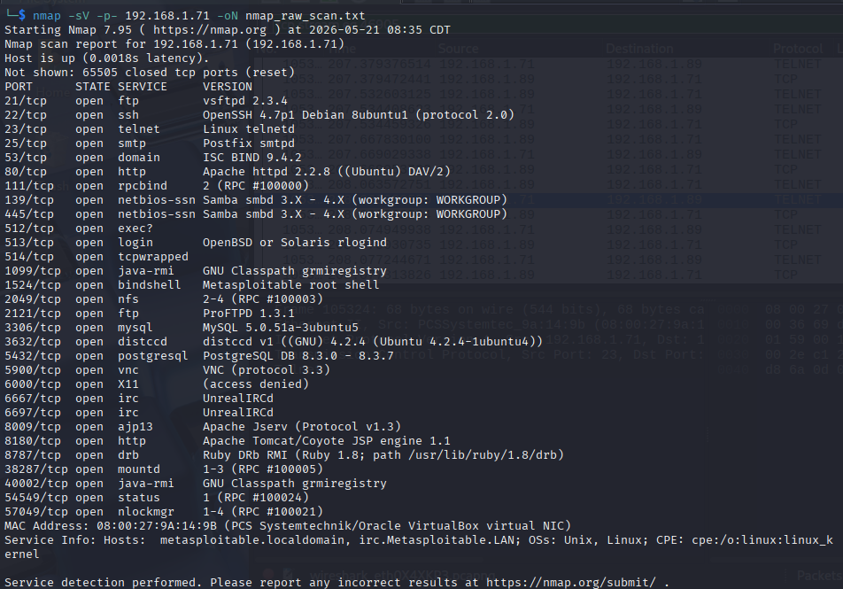
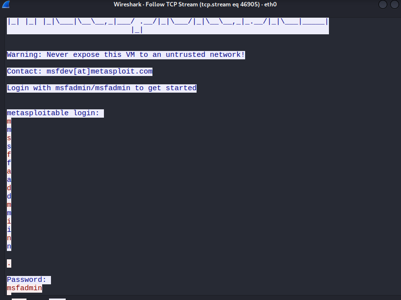

# Network Audit: Cleartext Credential Harvest (Telnet)

## 1. Executive Summary
During this internal security assessment, I identified that the target server is running the legacy Telnet protocol (Port 23). Telnet transmits data, including authentication credentials, in cleartext. I successfully intercepted a login session and recovered administrative credentials, posing a **CRITICAL** risk to the organization's confidentiality.

## 2. Environment & Tools
- **Target:** Metasploitable 2 (Linux) - IP: 192.168.1.71
- **Attacker:** Kali Linux - IP: 192.168.1.89
- **Tools:** Nmap (Recon), Wireshark (Sniffing), Telnet client.

## 3. Methodology & Proof of Concept

### Phase 1: Reconnaissance
I performed a service version scan to identify open ports and the software running on them.
`nmap -sV -p- 192.168.1.71`

> 
> *Figure 1: Nmap scan identifying Telnet on Port 23.*

### Phase 2: Traffic Interception
I initialized a packet capture on the local interface filtering for `telnet` traffic. While the sniffer was active, a remote login was simulated.

### Phase 3: Analysis (The Finding)
By following the TCP Stream of the captured packets, the following credentials were recovered:
- **Username:** msfadmin
- **Password:** msfadmin

> 
> *Figure 2: Captured credentials in plain text via TCP Stream.*

## 4. Remediation
**Recommendation:** Immediately disable the Telnet service. All remote administration must be conducted over **SSH (Secure Shell)** on Port 22, which uses encryption to protect data in transit.
